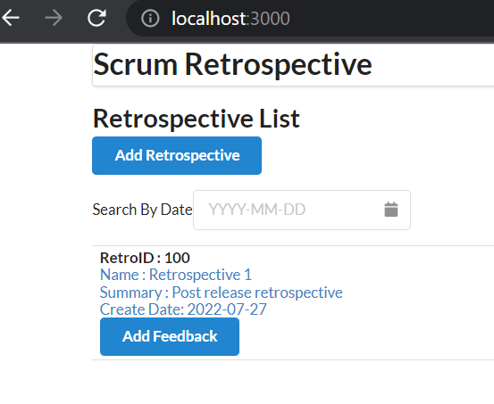
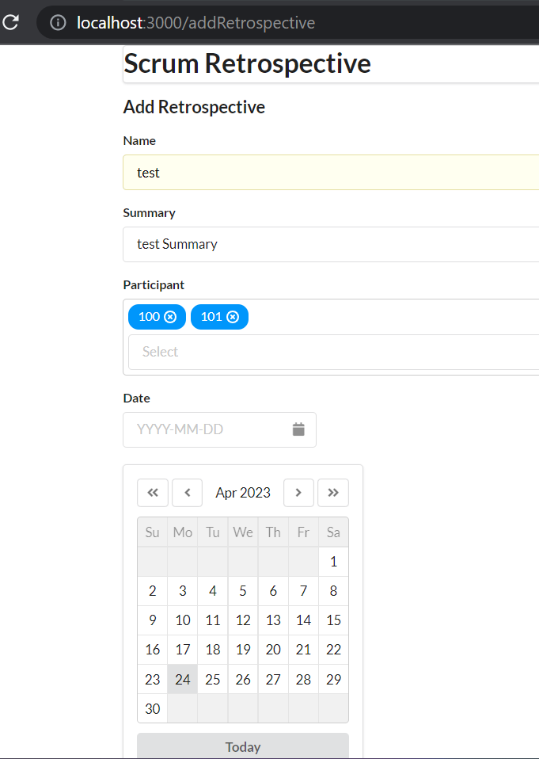

# Additional Library Used
Mutliselect Dropdown: https://www.npmjs.com/package/multiselect-react-dropdown

Json Server : was used initially for api call mock running on 3006 port. Setup is placed on separate folder as server-api and db.json is loaded for initial set of data

semantic-ui-react : is used for styling

axios : is used to make api call to backend and config is placed under api/RetrospectiveApi.js
Its connecting backend spring boot application on http://localhost:8080

React Hook: useState, useEffect, useNavigate

React Version : v6 

Design Pattern: Atom, Molecule, Organism

# Application Landing Page

## Application Add new scrum retrospective

# Getting Started with Create React App

This project was bootstrapped with [Create React App](https://github.com/facebook/create-react-app).

## Available Scripts

In the project directory, you can run:

### `npm start`

Runs the app in the development mode.\
Open [http://localhost:3000](http://localhost:3000) to view it in your browser.

The page will reload when you make changes.\
You may also see any lint errors in the console.

### `npm test`

Launches the test runner in the interactive watch mode.\
See the section about [running tests](https://facebook.github.io/create-react-app/docs/running-tests) for more information.